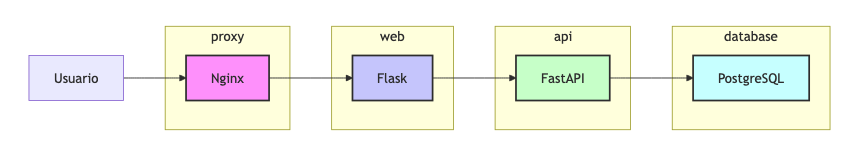

# Lenguaje de Programación 2 - Taller 5

Este taller práctico te guiará en el desarrollo de un sitio web tipo **Blog**, aplicando una arquitectura de microservicios. Aprenderás a construir una aplicación escalable y mantenible, descomponiendo la funcionalidad en cuatro componentes independientes.


- ver [badgen](https://badgen.net/) o [shields](https://shields.io/) para otros tipos de _badges_

## Autores

- Juan Camilo Peñaloza [@mastercelta](https://www.github.com/mastercelta)
- Cristian David [@CrysisDavid](https://www.github.com/CrysisDavid)

## Instrucciones


## Descripción del Proyecto

Este proyecto se centra en la construcción de un **Blog** moderno y escalable utilizando una arquitectura de microservicios. La aplicación se divide en cuatro componentes principales: una base de datos [PostgreSQL](https://www.postgresql.org/) para el almacenamiento persistente de datos, una API RESTful desarrollada con [FastAPI](https://fastapi.tiangolo.com/) para la comunicación entre los microservicios, una interfaz web creada con [React](https://es.react.dev/) para la interacción del usuario y un proxy inverso [Nginx](https://nginx.org/) para la gestión del tráfico y la mejora del rendimiento.

### Ventajas de los Microservicios

- **Escalabilidad**: Cada microservicio puede escalarse de forma independiente, optimizando el uso de recursos.
- **Mantenibilida:**: Los cambios en un microservicio no afectan a los demás, facilitando el mantenimiento y la actualización.
- **Flexibilidad**: Permite utilizar diferentes tecnologías para cada microservicio, adaptándose a las necesidades específicas.
- **Resiliencia**: La falla de un microservicio no tumba toda la aplicación.
- **Desarrollo Ágil**: Los equipos pueden trabajar en paralelo en diferentes microservicios, acelerando el desarrollo.

### Contenedores

1.  **Database**
    - Este contenedor se encarga del almacenamiento persistente de los datos del **Blog**, como las publicaciones, los comentarios y los usuarios.
    - Utilizaremos [PostgreSQL](https://www.postgresql.org/), una base de datos relacional que garantiza la integridad y la consistencia de los datos.
2.  **API**
    - Este contenedor expone una API RESTful que permite a la aplicación web acceder a la base de datos del blog, proporcionando _endpoints_ para crear, leer, actualizar y eliminar artículos, comentarios y usuarios.
    - Utilizaremos [FastAPI](https://fastapi.tiangolo.com/), un framework web moderno y de alto rendimiento que simplifica la creación de APIs.
3.  **Web**
    - Este contenedor se encarga de servir la interfaz web del blog a los usuarios, yconsumirá la API para mostrar los artículos, los comentarios y los usuarios.
    - Utilizaremos [React](https://es.react.dev/), un framework web de JavaScript flexible que permite crear aplicaciones web de forma rápida y sencilla.
4.  **Proxy**
    - Este contenedor actúa como un proxy inverso, recibiendo las peticiones de los usuarios y redirigiéndolas al o los servidores web.
    - Utilizaremos [Nginx](https://nginx.org/), un servidor web y proxy inverso de alto rendimiento que mejora el rendimiento y la seguridad de la aplicación.



## Objetivos

Al finalizar este taller, tendrás un conocimiento sólido de la arquitectura de microservicios y serás capaz de:

- Entender las ventajas y desventajas de la arquitectura de microservicios.
- Diseñar y construir aplicaciones web escalables y mantenibles.
- Implementar una API RESTful para la comunicación entre microservicios.
- Gestionar el enrutamiento y la distribución de carga con Nginx.
- Utilizar [PostgreSQL](https://www.postgresql.org/), [FastAPI](https://fastapi.tiangolo.com/), [React](https://es.react.dev/) y [Nginx](https://nginx.org/) para desarrollar microservicios.

## Desarrollo

### Configuración Inicial

Antes de comenzar, cada estudiante debe elegir un tema para el **Blog**, por ejemplo: tecnología, viajes, cocina, libros, películas, música, fotografía, o noticias locales.

1. Clona el repositorio `lp2-taller5` de la cuenta de GitHub `UR-CC`.

2. Revisa la estructura del proyecto.

```
blog-microservicios/
|__ .gitignore
|__ docker-compose.yml    # Configuración del grupo de contenedores
|__ README.md             # este archivo
|__ database/             # Base de datos PostgreSQL
|   |__ Dockerfile        # Configuración del contenedor 'database'
|   |__ init.sql          # Script de inicialización
|__ api/                  # API desarrollada en FastAPI
|   |__ app/
|   |   |__ main.py       # Punto de entrada
|   |__ Dockerfile        # Configuración del contenedor 'api'
|   |__ requirements.txt  # dependencias del proyecto 'api'
|__ web/                  # Aplicación web en React
|   |__ public/           # Archivos públicos (HTML, imágenes, etc.)
|   |   |__ index.html    # Archivo HTML principal
|   |__ src/              # Código fuente de React
|   |   |__ components/   # Componentes reutilizables
|   |   |__ pages/        # Páginas principales de la aplicación
|   |   |__ main.js       # Punto de entrada de React
|   |__ package.json      # Dependencias del proyecto 'web'
|   |__ Dockerfile        # Configuración del contenedor 'web'
|__ proxy/                # Nginx como proxy inverso
   |__ Dockerfile         # Configuración del contenedor 'proxy'
   |__ nginx.conf         # Configuración de Nginx
```

3. Actualiza el archivo `.gitignore`.

4. Recuerda siempre actualizar el archivo `README.md` con tus datos personales, los datos del proyecto, y cualquier otro cambio que se realice.

### Configuración de la Base de Datos

1. Ingresa al directorio `database`

2. Diseña el esquema de base de datos con las tablas:

   - `usuarios`: id, usuario, nombre, correo, password, fecha_creacion
   - `publicaciones`: id, titulo, contendo, url_imagen, id_usuario, fecha_creacion
   - `comentarios`: id, comentario, id_publicacion, id_usuario, fecha_creacion
   - y las relaciones entre tablas

3. De acuerdo al tema seleccionado, utiliza tu IA favorita para crear publicaciones de prueba:

   - Ejemplo de prompt para generar un post de blog:

   > Eres un autor de blogs con 15 años de experiencia escribiendo sobre [tema], escribe 15 artículos para un blog de [tema], cada artículo con 300-500 palabras. Cada artículo debe incluir: un título atractivo, y el contenido con una introducción que capture la atención, 3-4 secciones, y una conclusión.

4. Utiliza la misma IA para crear los datos ficticios de tus usuarios, y comentarios realistas para algunas publicaciones.

5. Con el contenido generado por las IA, crea un _script_ **SQL** de inicialización que defina las tablas y registre al menos 5 usuarios, 15 publicaciones y sus comentarios.

6. Actualiza el archivo de configuración de Docker asegurando la persistencia de los datos, incluso si el contenedor se reinicia.

7. Actualiza el `docker-compose.yml`, y prueba con `docker compose`.

8. Verifica que puedes realizar consultas a las tablas.

### Desarrollo de la API

1. Ingresa al directorio `api`

2. Actualiza el archivo `requirements.txt`, con las dependencias de tu proyecto:

   - [FastAPI](https://fastapi.tiangolo.com/): El _framework_ web de alto rendimiento para construir la API
   - [psycopg2](https://www.psycopg.org/docs/): El adaptador de PostgreSQL para Python, usa la versión `binary` para facilitar la instalación
   - [SQLAlchemy](https://www.sqlalchemy.org/): Un ORM para interactuar con la base de datos
   - [pydantic](https://docs.pydantic.dev/latest/): Una librería para la validación de datos, muy utilizada con FastAPI
   - [python-dotenv](https://github.com/theskumar/python-dotenv): Para cargar variables de entorno desde un archivo `.env`

3. Configura el **entorno virtual** e instala las dependencias

4. Desarrolla los modelos Pydantic para validación de datos

5. Implementa los _endpoints_:

   - `/users` - CRUD de los usuarios
   - `/posts` - CRUD de las publicaciones del blog
   - `/comments` - CRUD de los comentarios
   - Incluye paginación, filtrado y ordenación

6. Implementa la conexión a PostgreSQL usando SQLAlchemy

7. Actualiza el archivo de configuración de Docker.

8. Actualiza el `docker-compose.yml`, y prueba con `docker compose`.

9. Verifica que puedes realizar peticiones al API y obtener datos.

### Desarrollo de la Aplicación Web

1. Ingresa al directorio `web`

2. Actualiza el archivo `requirements.txt`, con las dependencias de tu proyecto:

   - [React](https://es.react.dev/): _Framework_ para aplicaciones web,
   - [axios](https://axios-http.com/): Una biblioteca para realizar solicitudes HTTP a tu API REST desde React.
   - [React-Bootstrap](https://react-bootstrap.github.io/): Una biblioteca que facilita la integración de componentes de Bootstrap en aplicaciones React.
   - [python-dotenv](https://github.com/theskumar/python-dotenv): Para cargar variables de entorno desde un archivo `.env`

3. Configura el **entorno virtual** e instala las dependencias

4. Selecciona algún diseño para tu **Blog**:

   - [Start Bootstrap](https://startbootstrap.com/templates/blog-news)
   - [Bootstrap Made](https://bootstrapmade.com/free-website-templates/)
   - [Theme Wagon](https://themewagon.com/theme-framework/bootstrap-5/?swoof=1&pa_price=free&paged=1&really_curr_tax=28-pa_frameworks)

5. Utiliza ese diseño para estructurar tu aplicación:

   - Define las rutas según sea necesario: `inicio`, `publicaciones`, `categorías`, etc.
   - Implementa los templates con [Jinja2](https://jinja.palletsprojects.com/en/stable/)
   - Crea formularios para crear/editar las publicaciones (posts)

6. Integra la aplicación con la API.

7. Desarrolla las interacciones entre las vistas:

   - Página de inicio con lista de las publicaciones más recientes
   - Vista detallada de cada publicación (posts)
   - Página de perfil de usuario

8. Actualiza el archivo de configuración de Docker.

9. Actualiza el `docker-compose.yml`, y prueba con `docker compose`.

10. Verifica que puedes acceder a la página y realizar las acciones esperadas.

#### Recursos para Imágenes de Prueba

Puedes obtener imágenes libres de derechos en [Unsplash](https://unsplash.com), [Pexels](https://pexels.com), o [Pixabay](https://pixabay.com).

Para una implementación más dinámica, puedes usar [Place holders](https://placehold.co/600x400?text=Mi+Blog) o [Lorem Picsum](https://picsum.photos/800/400).

### Configuración del Proxy

1. Ingresa al directorio `proxy`

2. Configura Nginx para:

   - Redireccionar peticiones al servidor Web

3. Actualiza el archivo de configuración de Docker.

4. Actualiza el `docker-compose.yml`, configura que este es el único contenedor accesible desde el _host_.

5. Prueba con `docker compose`.

6. Verifica que puedes acceder a la página y realizar las acciones esperadas.

### Publicación en GitHub

1. Verifica que todo funciona según lo esperado.

2. Actualiza el archivo `README.md` y verifica que las instrucciones de **Ejecución** funcionan según lo esperado.

3. Realiza un `push` al repositorio remoto.

## Ejecución

1. Clonar el repositorio:

```bash
git clone https://github.com/estudiante1/lp2-taller5.git
cd lp2-taller5
```

2. Construir y levantar los servicios:

   ```bash
   docker-compose up --build
   ```

3. Desde el navegador, acceder a: [http://localhost](http://localhost)

## Mejoras Opcionales

- Añade autenticación usando [JWT](https://es.wikipedia.org/wiki/JSON_Web_Token)
- Documenta la API con [Swagger](https://swagger.io/)/[OpenAPI](https://www.openapis.org/)
- Escribe [pruebas unitarias para los _endpoints_](https://www.youtube.com/watch?v=jM-zWp8dNQA)
- Implementa búsqueda de texto completo
- Añade categorías y etiquetas a las publicaciones
- Añade manejo de errores y excepciones
- Escribe pruebas unitarias para la aplicación
- Configurar SSL/TLS (opcional)
- Configurar compresión gzip
- Servir archivos estáticos
- Implementa un sistema de notificaciones
- Implementa un sistema de caché para mejorar el rendimiento
